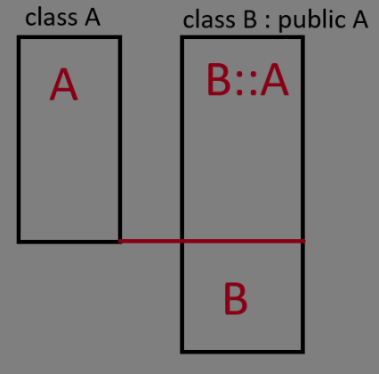

# Objektumorientált idióma

Senkit sem szeretnék a sablonszöveggel untatni, ha szép és kerek leírást keresünk arra itt a [wikipédia](https://en.wikipedia.org/wiki/Object-oriented_programming).

#### A lényeg
Az objektumorientált programozás alapja, hogy minden *dolog* ami a programunkban létezik egy objektum. 

*Encapsulation*
Az objektumok valamilyen blueprintek(C++ban classok) példányai. Az osztályok valamilyen állapotot és az azokon elvégezhető műveleteket írják le(tagváltozó ~ állapot, tagfüggvény ~ művelet).

*Inheritance* (leszármaztatás)
Van olyan eset, amikor egy adott dolog egyben egy másik dolog, csak kicsit kiegészítve, megváltoztatva. Pl. a Hallgató egy egyetemi polgár, viszont képes vizsgát felvenni és van kreditindexe.
Ekkor az egyetemi polgár a *"base class"* a hallgató pedig a "*subclass*" nevet kapja.

*Polymorphism*
Kéz a kézben jár a leszármaztatással. A fő lényege, hogy egy base class -ra mutató dolog kaphat subclass objektumot, és ezen a mutatón keresztül való viselkedés a subclass viselkedését mutatja.

*Abstraction*
A legtöbb esetben nem érdekel minket, hogy egy adott függvény vagy típus pontosan hogy működik, csak az, hogy mit csinál. Pl. az `std::string` `push_back()` tagfüggvénye beilleszt egy karaktert a sztring végére, de az hogy ezt hogy tesz az az átlag programozó számára(a típus felhasználója) nem érdekes. 
Ezt az elvet a jegyzet is alkalmazni fogja, nem lesznek definiálva tagfüggvények, ha azok implementációja jelentéktelen.


## Leszármazás

A leszármazás szintaktikája viszonylag egyszerű:

```cpp
class polgar{
public:
    std::string name;
    std::string neptun;
    std::string get_decorated_name() const {
        return name + std::string(" ") + neptun;
    }
};

class hallgato : public polgar {
public:
    double calculate_kreditindex();
    std::vector<Targy> targyak;
};
```

Egy adott leszármazott példány memóriaképét ekkor valahogy így kell elképzelni:<br>


Egyszerre több osztályból is le lehet származni, valamint leszármazottból is lehet tovább származtatni:
```cpp
class A {};
class B {};
class C : public A, public B {}

class D : public A {};
class E : public D {};
```

## Polimorfizmus
Ha `hallgato` a `polgar` leszármazottja, akkor `polgar` -ra mutató pointerek már képesek `hallgato` -ra mutatni, valamit `polgar` referencia tud `hallgato` objektumot alias-olni.
***FONTOS!*** Az inverz nem igaz.
```cpp
hallgato* h = new polgar;
```
hiszen itt a `h` egy olyan objektumra mutat amiben nincs meg a teljes `hallgato` rész.

***FONTOS!***
`polgar` típusú változóban `hallgato` objektumot tárolni és fordítva hiba! `polgar` típusú változóba `halgato` típusú objektumot rakva az objektum `hallgató` része levágódik és csak a `polgar` része marad meg. Ezt *object slicing*-nak hívjuk.

## Protected tagok

A `private` tagok nem láthatók a leszármazottakból sem. A `protected` tagok a leszármazottból látszanak, az osztályon kívülről viszont nem.

## Inheritance access specifiers

Mint ahogyan tagokból, leszármazásból is létezik publikus, protected és private.

Ezt a következőképp kell érteni:

**public**: a subclass és a külső kód is tud a leszármazásról, a leszármazotton keresztül a subclass és a külső kód is eléri a base class `public` tagjait, a `private` és `protected` tagokat viszont nem
**protected**: csak a subclass tud a leszármazásról, a leszármazotton keresztül csak a subclass éri el a base class `public` tagjait, a külső kód viszont egyáltalán nem éri el a base class tagjait
**private**: a subclass sem tud a leszármazásról, a leszármazotton keresztül nem érhetőek el a base class tagjai.

***Fontos, zhn szokott lenni***: a `struct`-al definiált osztályoknál a leszármazásnál is `public` a default, míg a `class`-al definiáltaknál `private`.

## Virtual tagfüggvények

Tegyük fel, hogy a hallgatók dekorált nevéhez hozzá szeretnénk adni, hogy "hallgató". Ehhez valahogyan "felül kell írnunk" a base class `get_decorated_name` függvényét. Azokat a függvényeket amelyeket felül lehet írni virtuális tagfüggvényeknek hívunk és a `virtual` keyworddel jelezzük őket. 
A base class-ra mutató pointeren keresztül tárolt subbclassnak a saját tagfüggvény verziója hívódik majd.

Az `ovverride` keyword opcionálisan a felülíró függvény fejléce után kerül, hasznos kiírni.

```cpp
class polgar{
public:
    std::string name;
    std::string neptun;
    virtual std::string get_decorated_name() const {
        return name + std::string(" ") + neptun;
    }
};

class hallgato : polgar {
public:
    double calculate_kreditindex();
    std::vector<Targy> targyak;

    virtual std::string get_decorated_name() const override {
        return std::string("hallgato ") + name + std::string(" ") + neptun;
    }
};

int main(){
    polgar* p = new hallgato("Gipsz Jakab", "ABC123");
    std::string name = p->get_decorated_name(); //hallgato tagfüggvényét hívja
    std::cout << name; //hallgato Gipsz Jakab ABC123
}
```

### Vtable

A virtuális függvényhívások egy speciális, vtable -nek nevezett adatstruktúrán keresztül történik. Amikor virtuális függvényt adunk egy osztályhoz, akkor az osztály kap egy rejtett tömböt, amely függvénypointereket("függvényeket") tárol. Ez a tömb tárolja az adott osztály implementációját a virtuális függvényekre.

*Miért szükséges ez?*<br>
Mivel base class pointer mutathat subclass objektumra, így fordításidőben nem tudhatjuk, hogy melyik függvényt kell hívni, ezért futásidőben ezt a tömböt használjuk, hogy a helyes függvényt hívjuk.

*Mekkora overheaddel jár ez?*<br>
A válasz: depends. Gyakorlatilag semekkorával, persze ez sok tényezőtől függ. Gyenge hardveren(pl. mikrokontrollerek) problémát jelenthet, azonban egy asztali számítógépen valószínűleg nem ez lesz a szűk keresztmetszet.

### Pure virtual function

Néha szeretnénk azt, hogy a base class ne legyen valóban példányosítható, hanem valamilyen függvényét implementálja minden subclass. Az ilyen függvényeket pure virtual functionnak, az osztály t pedig absztrakt osztálynak nevezzük. Pure virtual function-t az `=0` postfix-el deklarálhatunk.

```cpp
struct base {
    virtual void foo() = 0;
};

struct derived : base {
    virtual void foo() override {
        std::cout << "pog\n";
    }
}

int main(){
    base b; //error, cannot instantiate abstract class
    derived d; //ok
    base* p = new derived; //ok, base* mutat derived objektumra
    base* p2 = new base; //error, cannot instantiate abstract class

}
```

*Vegyük észre*: az `=0` szintaxis onnan jön, hogy a vtable-ben a függvény helyén egy 0 érték, "null pointer" lesz.

## Base class konstruktor és virtuális destruktor

Amikor egy leszármazott objektumot készítünk, akkor inicializálni kell annak base class "részét" is. Ehhez meg kell hívni a base class destruktorát(ha nincs neki default konstruktora).
Ezt a már jól ismert member initializer list-ről tehetjük meg.

```cpp
class polgar{
    std::string name;
    std::string neptun;
    virtual std::string get_decorated_name() const {
        return name + std::string(" ") + neptun;
    }

public:
    polgar(const std::string& name, const std::string& neptun) : name(name), neptun(neptun) {}
};

class hallgato : polgar {
    std::vector<Targy> targyak;
public:
    hallgato(const std::string& name, const std::string& neptun) : polgar(name, neptun) //a polgar konstruktorát hívjuk a name és neptun paraméterekkel
    {}

    double calculate_kreditindex();

    virtual std::string get_decorated_name() const override {
        return std::string("hallgato ") + name + std::string(" ") + neptun;
    }
};
```


```cpp
polgar* p = new hallgato("Gipsz Jakab", "ABC123");
```
Azonban van egy kis baj... A következő sor undefined behavior:
```cpp
delete p;
```

A probléma a destruktor kérdése. Ha a base classra mutató pointerre hívunk `delete` -t, akkor az a base class destruktorát fogja meghívni. Ez probléma, ha a subclass destruktora valamilyen erőforrást szabadít fel, viszont nem hívódik meg.

Erre a problémára nyújtanak megoldást a virtuális destruktorok. Amikor egy base-re mutató pointerre `delete`-t hívunk, akkor a láncon felfelé(legalsó leszármazott->legfelső leszármazott) meghívódik az összes destruktor.
```cpp
struct base {
    base() = default; //explicit default: "im okay with what the compiler gives me"
    virtual ~base() {
        std::cout << "base dtor\n";
    }
};

struct derived : base {
    derived() = default;
    virtual ~derived() {
        std::cout << "derived dtor\n";
    }
};

int main(){
    base* p = new derived;
    delete p;
}
```

Output:
```
derived dtor
base dtor
```

## 'final' keyword

A `final` keyword azt jelzi, hogy egy osztályból már nem lehet leszármazni.

```cpp
struct something final {};

struct something_else : something {}; //error, 'something' is final
```

## Virtual inheritance

A gyémánt probléma az OOP egyik legnagyobb kérdése. 
```cpp
struct A {
    int x;
};
struct B : A {};
struct C : A {};
struct D : B, C {};
```
Ekkor a leszármazási gráf egy "gyémánt" alakot alkot, amely a következő problémát veti fel: <br>
Amikor a `D` -n keresztül `A` beli tagokat érünk el, akkor azt a `D` osztály `B` vagy `C` részén tesszük -e meg?<br>
Ez akkora dilemma, hogy sok nyelv (pl Java) szimplán nem enged egyszerre több osztályból való származást.

C++ -ban ezt a problémát a virtuális leszármazással oldották meg.
# TODO