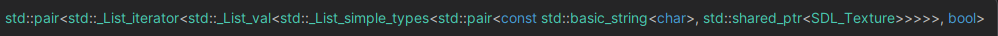

# Iterátorok

Az iterátor egy olyan típus, amely általános (generikus) módon képes iterálni egy tárolón.  Az iterátorok okos pointerek,
segítségükkel ugyanazzal az interfésszel iterálhatunk különböző konténereket.
Most elengedjük egy kicsit a tömböket, és megnézünk egy láncolt lisát.

```cpp
template <typename T>
class List{
    struct node{ //belső osztály, List<T>::node
        T data;
        node* next;
    };

    node* m_head;
    node* m_back;
    std::size_t m_size;

public:
    List() : m_head{nullptr}, m_back(nullptr), m_size(0) {}

    List(const List& other) : m_head(nullptr), m_back(nullptr), m_size(0) {
        for(const auto& elem : other) {
            push_back(elem);
        }
    }

    ~List() {
        //...
    }

    void push_front(T data) {
        //...
    }

    void push_back(const T& data) {
        //...
    }

    std::size_t size() const {
        return m_size;
    }
};
```

Ha ezen a listán végig szeretnénk iterálni, akkor az valamilyen ronda `->next` és `==nullptr` -el teli kódot eredményezne.

Ehelyett készíthetünk egy iterátor (belső) osztályt, amely az iterálás lépéseit absztraktálja el.
Ahhoz, hogy egy iterátor használható legyen legalább szükség van valamilyen léptető operátorra, valamint összehasonlító(== != stb.) operátorokra is.

Pl.:

<https://godbolt.org/z/qchjxE9en>
```cpp
template <typename T>
class List{
    struct node{
        T data;
        node* next;
    };

public:
    struct iterator{
        friend class List; 
    private:
        node* it; //az iterátor egy pointer absztrakció, azt tárolja hogy éppen melyik node-ra mutat
        explicit iterator(node* it) : it(it) {} //privát konstruktor, nem kell hogy a hívó fél manuálisan csináljon iterátorokat
    public:
        iterator(const iterator& other) : it(other.it) {}
        
        iterator& operator= (const iterator& other) {
            it = other.it;
            return *this;
        }

        /**
         * @brief léptető preincrement operátor, a current = current->next műveletet absztraktálja
         * @return
         */
        iterator& operator++() {
            it = it->next;
            return *this;
        }

        /**
         * @brief összehasonlító operátor FONTOS!
         * @param other
         * @return
         */
        bool operator==(const iterator& other) const {
            return it == other.it;
        }

        /**
         * @brief összehasonlító operátor FONTOS(talán a legfontosabb)
         * @param other
         * @return
         */
        bool operator!=(const iterator& other) const {
            return  !(it == other.it);
        }

        /**
         * @brief dereferencia operátor
         * @return
         */
        T& operator*() {
            return it->data;
        }

        /**
         * @brief konstans dereferencia operátor
         * @return
         */
        const T& operator*() const {
            return it->data;
        }

        /**
         * @brief nyíl operátor ha az iterátoron keresztül közvetlen egy osztály tagjait akarjuk elérni
         * @return
         */
        T* operator->() {
            return &(it->data);
        }

        //ugyanaz mint a másik, csak konstans
        T* operator->() const {
            return &(it->data);
        }
    };
};
```

Természetesen kellenek tagfüggvények, amelyek ennek a listának az iterátorait adják vissza:
`begin()` : A tároló elejére mutató iterátort ad vissza.<br>
`end()` : A tároló vége utáni("utolsó valid elem utáni") iterátort ad vissza, "szentinel" iterátort. Ez egy lista esetében pl. `nullptr` -re mutató iterátor.

Ez a begin-end interfész a C++ nyelv tárolói közt egységes, és később látjuk is, hogy van egy fontos nyelvi elem is, ami erre támaszkodik, ezért ezt érdemes követni.

```cpp
//List class-on belül, de nem az iterator-ban

public:
    /**
     * @brief begin tagfüggvény az iteráláshoz
     * @return az első elemre mutató iterátor
     */
    iterator begin() {
        return iterator(m_head);
    }

    // Minden iterátort visszaadó tagfüggvényből készül konstans verzió is ami konstans iterátort ad vissza.
    const iterator begin() const {
        return iterator(m_head);
    }

    /**
     * @brief end tagfüggvény az iteráláshoz
     * @return az utolsó érvényes elem "után" mutató iterátor, "sentinel" iterátor
     */
    iterator end() {
        return m_back == nullptr ? iterator(m_back) : iterator(m_back->next);
    }
    
    const iterator end() const {
        return m_back == nullptr ? iterator(m_back) : iterator(m_back->next);
    }
```

Iterátorok használata:

```cpp
int main(){
    List<int> list;

    for(int i = -3; i < 5; ++i){
        list.push_back(i);
    }

    for(List<int>::iterator it = list.begin(); it != list.end(); ++it) {
        std::cout << *it << ' ';
    }

    std::cout << '\n';
    *list.begin() = 5;
}
```

*Megjegyzés:* Az iterátorok típusai nagyon hosszúak is lehetnek, ezért általában az `auto` kulcsszót szokás használni. Ez fordításidőben levezeti és behelyettesíti a helyes típust ahol lehet. Pl.
```cpp
List<int>::iterator it = list.begin();
//helyett
auto it = list.begin();
```
Egy példa egy brutál hosszú típusnévre, amit senkinek sincs kedve kiírni (ennek kb. fele az iterátor) :


A fent látott

```cpp
for(List<int>::iterator it = list.begin(); it != list.end(); ++it) {
        std::cout << *it << ' ';
}
```
kódrészlet olyan gyakori, hogy külön szintaxis létezik rá:

```cpp
for(int elem : list) { //minden elemet lemásolunk egyesével
        std::cout << elem << ' ';
}

for(int& elem : list) { //minden elemre referenciával hivatkozunk
        std::cout << elem << ' ';
}

for(const int& elem : list) { //ua. mint az előbb, csak konstans referenciával
        std::cout << elem << ' ';
}
```

Természetesen itt is használhatjuk az `auto` kulcsszót:

```cpp
for(const auto& elem : list) { 
        std::cout << elem << ' ';
}
```


## Iterátorok, tömbök és pointerek

Egy tömb egy elemére mutató pointer kielégíti az iterátorok legmélyebb követelményét, a [*LegacyContiguousIterator*](https://en.cppreference.com/w/cpp/named_req/ContiguousIterator) követelményt. 

Ha belegondolunk, a pointereken működnek a +, +=, ++, ==, !=, stb. operátorok, valamint ezek valóban a tároló elemei közti lépéseket valósítják meg.
<br>Ez azt jelenti, hogy egy dinamikus tömbnél például nincs szükség külön iterátor osztályra, hiszen elég a pointereket léptetni és összehasonlítani.

Ez azt jelenti, hogy egy dinamikus tömböt elég ennyivel kiegészíteni:
```cpp
    T* begin() {
        return tomb;
    }

    const T* begin() const {
        return tomb;
    }

    T* end() {
        return tomb + meret;
    }

    const T* end() const {
        return tomb + meret;
    }
```

## Kiegészítés: Iterátorok besorolása

Az iterátorokat besorolhatjuk az alapján, hogy mire képesek. Ezeket a csoportokat nem kell tudni, csak érdekességképp szerepelnek a jegyzetben:

