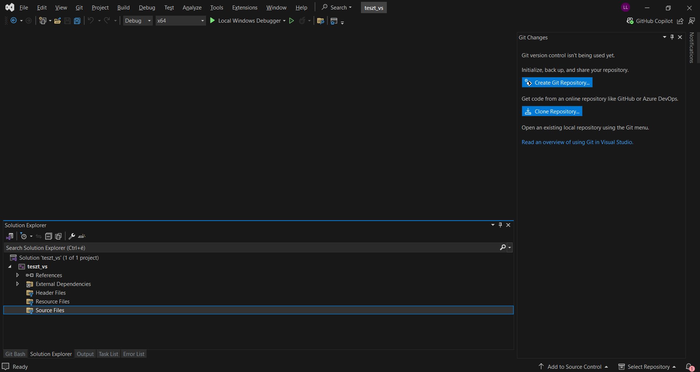
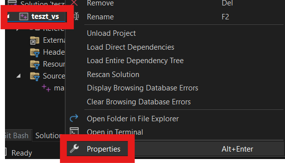
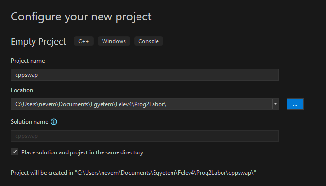
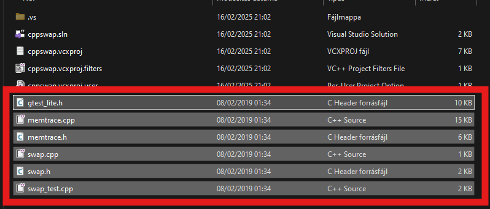
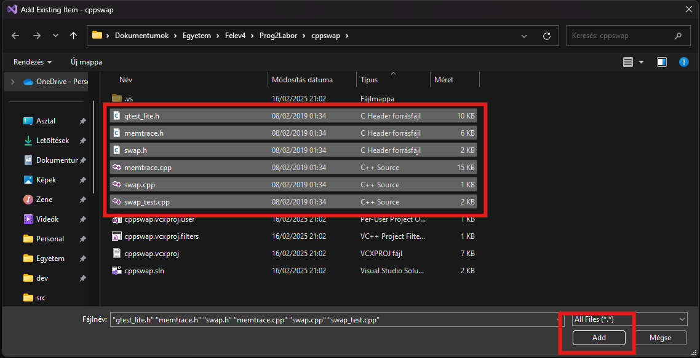
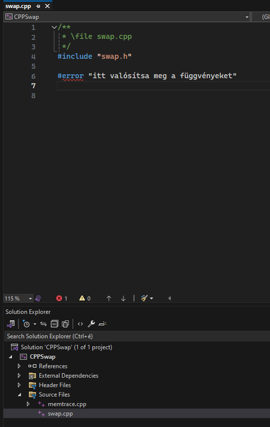
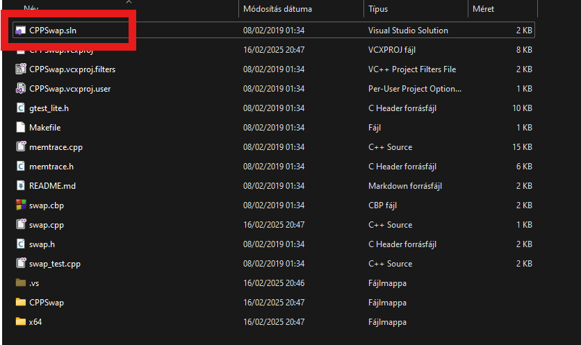
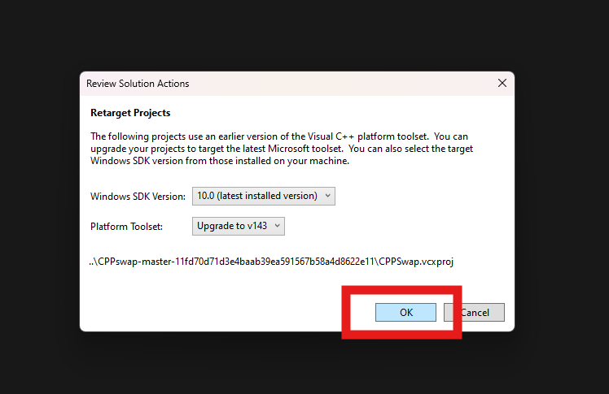

# Visual Studio
A Visual Studio a Microsoft fejlesztőkörnyezete, beépített devkitekkel, debuggerrel, profilerrel és egyéb finom dolgokkal. Works out of the box, nem bonyolult a setup. Hátránya, hogy Windows rendszeren kívül nem 
létezik a Windowson használható verziója.

***Nem összekeverendő a Visual Studio Code -al.***

## Ajánlott platformok

Windows

## VS Community Edition

A Visual Studio Community Edition teljesen ingyenesen letölthető a <https://visualstudio.microsoft.com/free-developer-offers/> linkről. Fontos, hogy a bal oldali, "Visual Studio Community" opciót válasszuk,
a Visual Studio Code egy teljesen más szoftver.

## VS Enterprise Edition

Egyetemistaként elérhető ingyenes licensz a Visual Studio Enterprise verziójához. Ehhez először, ha még nem tetted meg, a <https://login.bme.hu/admin/username/> oldalon kell beállíts egy Office 365 emailt.
Ebbe az emailbe egyébként Outlook-on keresztül egyszerűen be tudsz lépni. Ezután a <https://azureforeducation.microsoft.com/devtools> oldalon ezzel a fiókkal belépve tudod a VS és más hasznos(pl. Windows) 
aktiváló kulcsokat elérni.

## Telepítés

A Visual Studio Installer program központosítva tud VS verziókat telepíteni és módosítnai. Ezt megnyitva, ha az "Installed" fülön még nincs ott a kívánt verzió(Visual Studio 2022), akkor ezt az "Available" fülről lehet telepíteni.<br>
A felugró ablakból a tárgyhoz a "Desktop Development with C++" Workload-ra lesz csak szükség. Emellett az "Individual components" fülről ajánlott még a "C++ AddressSanitizer" komponens.<br>

<br>


## Projekt létrehozása

Visual Studioban a fő struktúra a következő: A root egy "solution" amiben több project is lehet. Ez teszi lehetővé azt, hogy komplex programokat akár részenként is használhassunk.<br>
Új projekt létrehozásához indítsuk el a Visual Studiot, majd kattintsunk a "Create a new project" gombra.<br>
Ezután válasszuk az alábbi opciót:<br>
<br>
Ezután adunk egy nevet a projectnek, kiválasztjuk hogy hova kerüljön(egyetem mappa, stb.), valamint, ha nem szeretnénk hogy a project és a solution ugyanabban a mappában legyen(nagyobb projekteknél nem ajánlott), akkor adunk egy külön nevet a solutionnek is. 



A Solution Explorert, ha nem jelent meg, érdemes előhozni a View>Solution Explorer opcióval. Általában az ablak jobb oldalán jelenik meg, de személyes preferencia, hogy ki hova helyezi el.

## Ajánlott beállítások

A Projektünk beállításait a "Solution Explorer"-ben a projektre jobbklikk>Properties -re kattintva érhetjük el.


### Command Line opciók

A Project Properties -en belül a C/C++>Command Line fülön az "Additional Options" részbe tudunk command line flageket írni.

Ajánlott flagek:

* `/Wall`
* `/WX` (ez a `Werror` megfelelője)
* `/permissive-`
* `/fsanitize=address`

## Hello World!

Hozzunk létre egy új file-t `main.cpp` néven. Ezt a Solution Explorer-ben a "Source Files"-re jobb kattintva `Add>New item...>C++ file` opciókkal tehetjük meg.

A `main.cpp` fileba az alábbi kódrészletet illesztve:
```cpp
#include <iostream>

int main(){
	std::cout << "Hello, World!";
	return 0;
}
```

Majd az `F5` billenytűt leütve letesztelhetjük, hogy műküdik -e a setupunk.<br>


A "Source Files", "Header Files" stb. nem valódi mappák, a Visual Studio "Filer"-nek nevezi őket, a fileok valójában mind ugyanabban a mappában vannak. Ez megsegíti a headerekkel való munkát.

Meglévő fileokat az új fileok létrehozásához hasonlóan tudunk létrehozni, a `New item...` helyett az `Existing item...` menüpontot kell választanunk.

## CPPSwap feladat beállítása

Töltsük le a <https://git.ik.bme.hu/Prog2/ell_feladat/CPPswap> oldalról a feladat alapját. Ezek a fileok közül a `.h` és `.cpp` fileokra lesz szükség. 


Hozzunk létre egy új Visual Studio projektet. 



Másoljuk a fentebb említett fileokat a projekt mappájába (ahol a `.vcxproj` file van). Csak üres mappába hozzunk létre VS Projektet, aztán másoljuk be a szükséges fileokat.



Ezután adjuk hozzá a fileokat a projekthez.




Ezután futtassuk a projektet.

A Solution Explorerből keressük ki a `swap.cpp` filet és nyissuk meg.

(A `#error` preprocesszor direktívával lehet szándékos fordításidejű hibát tenni a kódba hibaüzenettel együtt)



#### Megjegyzés a laborfeladatokhoz:

Néhány feladathoz jön Visual Studio projekt és solution file, alternatívaként ezek is használatók. Amikor a VS felajánlja, hogy upgradeljük a Windows SDK-t, akkor fogadjuk el a promptot. 



